# Struktur Tabel siklik

Dibuat otomatis oleh `php artisan siklik:dok-tabel` pada 11/09/2026 08:46 dari data dictionary Oracle. Jangan edit manual.
Versi interaktif (selalu terbaru): menu **Sistem → Struktur Tabel** (`/panduan-dev/struktur-tabel`).

| Tabel | View | Relasi FK | Relasi implisit | Objek di-rename |
|---|---|---|---|---|
| 122 | 41 | 147 | 3 | 133 |

## 1. Aturan nama (sejak 11 Sep 2026)

Huruf modul lama `DI IM LB RS SC TK` dilebur menjadi prefix program `SK`; jenis objek dipertahankan.

| Prefix | Arti |
|---|---|
| `SKMST_` | Master / referensi (jarang berubah, dirawat lewat menu Master) |
| `SKTXN_` | Transaksi (bertambah tiap hari: kunjungan, penjualan, penerimaan, kas) |
| `SKACC_` | Akuntansi (bagan akun, cara bayar, konfigurasi jurnal) |
| `SKVIEW_` | View Oracle (hasil gabungan untuk layar/laporan, tidak ditulis aplikasi) |

Tidak di-rename: tabel sistem Laravel/Spatie, `PASIEN`, `REF_BPJS_TABLE`, `REFERENSI_MOBILEJKN_BPJS`, `WEB_LOG_STATUS`, `INSTALL_TOKOKU`, semua sequence & trigger.
Nama lama tetap bisa dipakai lewat synonym (untuk siklik-lite legacy); kode siklik-php82 wajib memakai nama baru.
Skrip & urutan eksekusi: `database/sql/rename-siklik/README.md`.

## 2. Peta rename

| Jenis | Lama | Baru | Modul |
|---|---|---|---|
| TABLE | `DIMST_APPLICATIONS` | `SKMST_APPLICATIONS` | Aplikasi & Identitas |
| TABLE | `DIMST_IDENTITASES` | `SKMST_IDENTITASES` | Aplikasi & Identitas |
| TABLE | `DIMST_USERAPPLICATIONS` | `SKMST_USERAPPLICATIONS` | Aplikasi & Identitas |
| TABLE | `DIMST_USERS` | `SKMST_USERS` | Aplikasi & Identitas |
| TABLE | `IMMST_CONTENTS` | `SKMST_CONTENTS` | Apotek & Gudang (master) |
| TABLE | `IMMST_PRODUCTCONTENTS` | `SKMST_PRODUCTCONTENTS` | Apotek & Gudang (master) |
| TABLE | `LBMST_CLABITEMS` | `SKMST_CLABITEMS` | Laboratorium |
| TABLE | `LBMST_CLABS` | `SKMST_CLABS` | Laboratorium |
| TABLE | `LBTXN_CHECKUPDTLS` | `SKTXN_CHECKUPDTLS` | Laboratorium |
| TABLE | `LBTXN_CHECKUPHDRS` | `SKTXN_CHECKUPHDRS` | Laboratorium |
| TABLE | `LBTXN_CHECKUPOBATS` | `SKTXN_CHECKUPOBATS` | Laboratorium |
| TABLE | `LBTXN_CHECKUPOUTDTLS` | `SKTXN_CHECKUPOUTDTLS` | Laboratorium |
| TABLE | `RSMST_ACCDOCOTHERS` | `SKMST_ACCDOCOTHERS` | Tarif & Jasa |
| TABLE | `RSMST_ACCDOCPRODUCTS` | `SKMST_ACCDOCPRODUCTS` | Tarif & Jasa |
| TABLE | `RSMST_ACCDOCS` | `SKMST_ACCDOCS` | Tarif & Jasa |
| TABLE | `RSMST_ACTEMPS` | `SKMST_ACTEMPS` | Tarif & Jasa |
| TABLE | `RSMST_ACTEOTHERS` | `SKMST_ACTEOTHERS` | Tarif & Jasa |
| TABLE | `RSMST_ACTEPRODS` | `SKMST_ACTEPRODS` | Tarif & Jasa |
| TABLE | `RSMST_ACTPARAMEDICS` | `SKMST_ACTPARAMEDICS` | Tarif & Jasa |
| TABLE | `RSMST_ACTPAROTHERS` | `SKMST_ACTPAROTHERS` | Tarif & Jasa |
| TABLE | `RSMST_ACTPARPRODUCTS` | `SKMST_ACTPARPRODUCTS` | Tarif & Jasa |
| TABLE | `RSMST_DESAS` | `SKMST_DESAS` | Wilayah |
| TABLE | `RSMST_DOCTORS` | `SKMST_DOCTORS` | Pasien & Klinik |
| TABLE | `RSMST_EDUCATIONS` | `SKMST_EDUCATIONS` | Pasien & Klinik |
| TABLE | `RSMST_ENTRYTYPES` | `SKMST_ENTRYTYPES` | Pasien & Klinik |
| TABLE | `RSMST_JOBS` | `SKMST_JOBS` | Pasien & Klinik |
| TABLE | `RSMST_KABUPATENS` | `SKMST_KABUPATENS` | Wilayah |
| TABLE | `RSMST_KECAMATANS` | `SKMST_KECAMATANS` | Wilayah |
| TABLE | `RSMST_KLAIMTYPES` | `SKMST_KLAIMTYPES` | Pasien & Klinik |
| TABLE | `RSMST_LOINC_CODES` | `SKMST_LOINC_CODES` | Terminologi SATUSEHAT |
| TABLE | `RSMST_MEDIK` | `SKMST_MEDIK` | Pasien & Klinik |
| TABLE | `RSMST_MSTDIAGS` | `SKMST_MSTDIAGS` | Pasien & Klinik |
| TABLE | `RSMST_MSTPROCEDURES` | `SKMST_MSTPROCEDURES` | Pasien & Klinik |
| TABLE | `RSMST_OTHERS` | `SKMST_OTHERS` | Pasien & Klinik |
| TABLE | `RSMST_OUTS` | `SKMST_OUTS` | Pasien & Klinik |
| TABLE | `RSMST_PARAMETERS` | `SKMST_PARAMETERS` | Aplikasi & Identitas |
| TABLE | `RSMST_PASIENS` | `SKMST_PASIENS` | Pasien & Klinik |
| TABLE | `RSMST_POLIS` | `SKMST_POLIS` | Pasien & Klinik |
| TABLE | `RSMST_PROPINSIS` | `SKMST_PROPINSIS` | Wilayah |
| TABLE | `RSMST_RADIOLOGIS` | `SKMST_RADIOLOGIS` | Pasien & Klinik |
| TABLE | `RSMST_RELIGIONS` | `SKMST_RELIGIONS` | Pasien & Klinik |
| TABLE | `RSMST_SNOMED_CODES` | `SKMST_SNOMED_CODES` | Terminologi SATUSEHAT |
| TABLE | `RSTXN_RJACCDOCS` | `SKTXN_RJACCDOCS` | Rawat Jalan |
| TABLE | `RSTXN_RJACTEMPS` | `SKTXN_RJACTEMPS` | Rawat Jalan |
| TABLE | `RSTXN_RJACTPARAMS` | `SKTXN_RJACTPARAMS` | Rawat Jalan |
| TABLE | `RSTXN_RJCASHINS` | `SKTXN_RJCASHINS` | Rawat Jalan |
| TABLE | `RSTXN_RJDTLS` | `SKTXN_RJDTLS` | Rawat Jalan |
| TABLE | `RSTXN_RJHDRS` | `SKTXN_RJHDRS` | Rawat Jalan |
| TABLE | `RSTXN_RJLABS` | `SKTXN_RJLABS` | Rawat Jalan |
| TABLE | `RSTXN_RJOBATRACIKANS` | `SKTXN_RJOBATRACIKANS` | Rawat Jalan |
| TABLE | `RSTXN_RJOBATS` | `SKTXN_RJOBATS` | Rawat Jalan |
| TABLE | `RSTXN_RJOTHERS` | `SKTXN_RJOTHERS` | Rawat Jalan |
| TABLE | `RSTXN_RJRADS` | `SKTXN_RJRADS` | Rawat Jalan |
| TABLE | `RSTXN_RJUPLOADBPJSES` | `SKTXN_RJUPLOADBPJSES` | Rawat Jalan |
| TABLE | `RSTXN_SHIFTCTLS` | `SKTXN_SHIFTCTLS` | Rawat Jalan |
| TABLE | `SCMST_SCDAYS` | `SKMST_SCDAYS` | Pasien & Klinik |
| TABLE | `SCMST_SCPOLIS` | `SKMST_SCPOLIS` | Pasien & Klinik |
| TABLE | `TKACC_ACCOUNTSES` | `SKACC_ACCOUNTSES` | Akuntansi |
| TABLE | `TKACC_CARABAYARS` | `SKACC_CARABAYARS` | Akuntansi |
| TABLE | `TKACC_CONFACCTXNS` | `SKACC_CONFACCTXNS` | Akuntansi |
| TABLE | `TKACC_GR_ACCOUNTSES` | `SKACC_GR_ACCOUNTSES` | Akuntansi |
| TABLE | `TKACC_TEMACCOUNTES` | `SKACC_TEMACCOUNTES` | Akuntansi |
| TABLE | `TKACC_TEMLABARUGINERACADTLS` | `SKACC_TEMLABARUGINERACADTLS` | Akuntansi |
| TABLE | `TKACC_TEMLABARUGINERACAHDRS` | `SKACC_TEMLABARUGINERACAHDRS` | Akuntansi |
| TABLE | `TKACC_TUCICOS` | `SKACC_TUCICOS` | Akuntansi |
| TABLE | `TKMST_CATEGORIES` | `SKMST_CATEGORIES` | Apotek & Gudang (master) |
| TABLE | `TKMST_CUSTOMERS` | `SKMST_CUSTOMERS` | Apotek & Gudang (master) |
| TABLE | `TKMST_EX_IMS` | `SKMST_EX_IMS` | Apotek & Gudang (master) |
| TABLE | `TKMST_KASIRS` | `SKMST_KASIRS` | Apotek & Gudang (master) |
| TABLE | `TKMST_KOTAS` | `SKMST_KOTAS` | Apotek & Gudang (master) |
| TABLE | `TKMST_PRODUCTPAKETS` | `SKMST_PRODUCTPAKETS` | Apotek & Gudang (master) |
| TABLE | `TKMST_PRODUCTS` | `SKMST_PRODUCTS` | Apotek & Gudang (master) |
| TABLE | `TKMST_PROVS` | `SKMST_PROVS` | Apotek & Gudang (master) |
| TABLE | `TKMST_SUPPLIERS` | `SKMST_SUPPLIERS` | Apotek & Gudang (master) |
| TABLE | `TKMST_UOMS` | `SKMST_UOMS` | Apotek & Gudang (master) |
| TABLE | `TKTXN_CASHINDTLS` | `SKTXN_CASHINDTLS` | Kas & Hutang-Piutang |
| TABLE | `TKTXN_CASHINHDRS` | `SKTXN_CASHINHDRS` | Kas & Hutang-Piutang |
| TABLE | `TKTXN_CASHOUTDTLS` | `SKTXN_CASHOUTDTLS` | Kas & Hutang-Piutang |
| TABLE | `TKTXN_CASHOUTHDRS` | `SKTXN_CASHOUTHDRS` | Kas & Hutang-Piutang |
| TABLE | `TKTXN_RCVDTLS` | `SKTXN_RCVDTLS` | Apotek & Gudang (transaksi) |
| TABLE | `TKTXN_RCVHDRS` | `SKTXN_RCVHDRS` | Apotek & Gudang (transaksi) |
| TABLE | `TKTXN_RCVPAYMENTS` | `SKTXN_RCVPAYMENTS` | Apotek & Gudang (transaksi) |
| TABLE | `TKTXN_SALDOAWALAKUNS` | `SKTXN_SALDOAWALAKUNS` | Kas & Hutang-Piutang |
| TABLE | `TKTXN_SALDOAWALHUTANGS` | `SKTXN_SALDOAWALHUTANGS` | Kas & Hutang-Piutang |
| TABLE | `TKTXN_SALDOAWALPIUTANGS` | `SKTXN_SALDOAWALPIUTANGS` | Kas & Hutang-Piutang |
| TABLE | `TKTXN_SALDOAWALSTOCKS` | `SKTXN_SALDOAWALSTOCKS` | Apotek & Gudang (transaksi) |
| TABLE | `TKTXN_SLSDTLS` | `SKTXN_SLSDTLS` | Apotek & Gudang (transaksi) |
| TABLE | `TKTXN_SLSHDRS` | `SKTXN_SLSHDRS` | Apotek & Gudang (transaksi) |
| TABLE | `TKTXN_SLSKIRIMS` | `SKTXN_SLSKIRIMS` | Apotek & Gudang (transaksi) |
| TABLE | `TKTXN_SLSPAYMENTS` | `SKTXN_SLSPAYMENTS` | Apotek & Gudang (transaksi) |
| TABLE | `TKTXN_SOWHS` | `SKTXN_SOWHS` | Apotek & Gudang (transaksi) |
| TABLE | `TKTXN_TUCASHINS` | `SKTXN_TUCASHINS` | Kas & Hutang-Piutang |
| TABLE | `TKTXN_TUCASHOUTS` | `SKTXN_TUCASHOUTS` | Kas & Hutang-Piutang |
| VIEW | `DIVIEW_APPLICATIONS` | `SKVIEW_APPLICATIONS` | Aplikasi & Identitas |
| VIEW | `RSVIEW_CHECKUPS` | `SKVIEW_CHECKUPS` | Rawat Jalan |
| VIEW | `RSVIEW_DASHBOARD10RJS` | `SKVIEW_DASHBOARD10RJS` | Rawat Jalan |
| VIEW | `RSVIEW_DASHBOARDKUNJ_C_LAB` | `SKVIEW_DASHBOARDKUNJ_C_LAB` | Rawat Jalan |
| VIEW | `RSVIEW_DASHBOARDKUNJ_C_LABX` | `SKVIEW_DASHBOARDKUNJ_C_LABX` | Rawat Jalan |
| VIEW | `RSVIEW_DASHBOARDKUNJ_D_LAB` | `SKVIEW_DASHBOARDKUNJ_D_LAB` | Rawat Jalan |
| VIEW | `RSVIEW_DASHBOARDKUNJ_D_LABX` | `SKVIEW_DASHBOARDKUNJ_D_LABX` | Rawat Jalan |
| VIEW | `RSVIEW_DASHBOARDSLANJUTAN` | `SKVIEW_DASHBOARDSLANJUTAN` | Rawat Jalan |
| VIEW | `RSVIEW_DASHBOARD_F20_HTCT` | `SKVIEW_DASHBOARD_F20_HTCT` | Rawat Jalan |
| VIEW | `RSVIEW_DASHBOARD_F20_JML` | `SKVIEW_DASHBOARD_F20_JML` | Rawat Jalan |
| VIEW | `RSVIEW_DB_RJS` | `SKVIEW_DB_RJS` | Rawat Jalan |
| VIEW | `RSVIEW_DRRJANTRIAN` | `SKVIEW_DRRJANTRIAN` | Rawat Jalan |
| VIEW | `RSVIEW_ERMSTATUS` | `SKVIEW_ERMSTATUS` | Rawat Jalan |
| VIEW | `RSVIEW_RADS` | `SKVIEW_RADS` | Rawat Jalan |
| VIEW | `RSVIEW_RJKASIR` | `SKVIEW_RJKASIR` | Rawat Jalan |
| VIEW | `RSVIEW_RJRADS` | `SKVIEW_RJRADS` | Rawat Jalan |
| VIEW | `RSVIEW_RJREGS` | `SKVIEW_RJREGS` | Rawat Jalan |
| VIEW | `RSVIEW_RJSTRS` | `SKVIEW_RJSTRS` | Rawat Jalan |
| VIEW | `RSVIEW_RJUPLOADBPJSES` | `SKVIEW_RJUPLOADBPJSES` | Rawat Jalan |
| VIEW | `RSVIEW_RSLABS` | `SKVIEW_RSLABS` | Rawat Jalan |
| VIEW | `SCVIEW_SCPOLIS` | `SKVIEW_SCPOLIS` | Pasien & Klinik |
| VIEW | `TKVIEW_ACCOUNTS` | `SKVIEW_ACCOUNTS` | Akuntansi |
| VIEW | `TKVIEW_ACCOUNTS_LABARUGI` | `SKVIEW_ACCOUNTS_LABARUGI` | Akuntansi |
| VIEW | `TKVIEW_ACCOUNTS_NERACA` | `SKVIEW_ACCOUNTS_NERACA` | Akuntansi |
| VIEW | `TKVIEW_ACCTEMPLATE` | `SKVIEW_ACCTEMPLATE` | Akuntansi |
| VIEW | `TKVIEW_HPPES` | `SKVIEW_HPPES` | Apotek & Gudang (transaksi) |
| VIEW | `TKVIEW_IOHUTANGS` | `SKVIEW_IOHUTANGS` | Kas & Hutang-Piutang |
| VIEW | `TKVIEW_IOPIUTANGS` | `SKVIEW_IOPIUTANGS` | Kas & Hutang-Piutang |
| VIEW | `TKVIEW_IOSTOCKWHS` | `SKVIEW_IOSTOCKWHS` | Apotek & Gudang (transaksi) |
| VIEW | `TKVIEW_LASTRCV` | `SKVIEW_LASTRCV` | Apotek & Gudang (transaksi) |
| VIEW | `TKVIEW_RCVDTLS` | `SKVIEW_RCVDTLS` | Apotek & Gudang (transaksi) |
| VIEW | `TKVIEW_RCVHDRS` | `SKVIEW_RCVHDRS` | Apotek & Gudang (transaksi) |
| VIEW | `TKVIEW_RCVPAYS` | `SKVIEW_RCVPAYS` | Apotek & Gudang (transaksi) |
| VIEW | `TKVIEW_SALDOAKHIRSTOCKS` | `SKVIEW_SALDOAKHIRSTOCKS` | Apotek & Gudang (transaksi) |
| VIEW | `TKVIEW_SALDOAWALHUTANG` | `SKVIEW_SALDOAWALHUTANG` | Kas & Hutang-Piutang |
| VIEW | `TKVIEW_SALDOAWALPIUTANG` | `SKVIEW_SALDOAWALPIUTANG` | Kas & Hutang-Piutang |
| VIEW | `TKVIEW_SALDOAWALSTOCKS` | `SKVIEW_SALDOAWALSTOCKS` | Apotek & Gudang (transaksi) |
| VIEW | `TKVIEW_SALDOSTOCK_LIST` | `SKVIEW_SALDOSTOCK_LIST` | Apotek & Gudang (transaksi) |
| VIEW | `TKVIEW_SLSHDRS` | `SKVIEW_SLSHDRS` | Apotek & Gudang (transaksi) |
| VIEW | `TKVIEW_SLSPAYS` | `SKVIEW_SLSPAYS` | Apotek & Gudang (transaksi) |

## 3. Tabel per modul & relasi

Panah `→` = FK terdeklarasi (dijaga Oracle). Panah `⇢` = relasi implisit: kolom bernama sama dengan PK tabel lain tanpa FK, dijaga oleh kode.

### Rawat Jalan

_Kunjungan rawat jalan: header (CLOB EMR), rincian tindakan/obat/lab/rad, kasir, upload BPJS_

| Objek | Jenis | Kolom |
|---|---|---|
| `SKTXN_RJACCDOCS` | TABLE | 5 |
| `SKTXN_RJACTEMPS` | TABLE | 4 |
| `SKTXN_RJACTPARAMS` | TABLE | 4 |
| `SKTXN_RJCASHINS` | TABLE | 9 |
| `SKTXN_RJDTLS` | TABLE | 3 |
| `SKTXN_RJHDRS` | TABLE | 36 |
| `SKTXN_RJLABS` | TABLE | 5 |
| `SKTXN_RJOBATRACIKANS` | TABLE | 20 |
| `SKTXN_RJOBATS` | TABLE | 15 |
| `SKTXN_RJOTHERS` | TABLE | 7 |
| `SKTXN_RJRADS` | TABLE | 12 |
| `SKTXN_RJUPLOADBPJSES` | TABLE | 4 |
| `SKTXN_SHIFTCTLS` | TABLE | 7 |
| `SKVIEW_CHECKUPS` | VIEW | 9 |
| `SKVIEW_DASHBOARD10RJS` | VIEW | 5 |
| `SKVIEW_DASHBOARDKUNJ_C_LAB` | VIEW | 4 |
| `SKVIEW_DASHBOARDKUNJ_C_LABX` | VIEW | 3 |
| `SKVIEW_DASHBOARDKUNJ_D_LAB` | VIEW | 4 |
| `SKVIEW_DASHBOARDKUNJ_D_LABX` | VIEW | 3 |
| `SKVIEW_DASHBOARDSLANJUTAN` | VIEW | 8 |
| `SKVIEW_DASHBOARD_F20_HTCT` | VIEW | 7 |
| `SKVIEW_DASHBOARD_F20_JML` | VIEW | 4 |
| `SKVIEW_DB_RJS` | VIEW | 4 |
| `SKVIEW_DRRJANTRIAN` | VIEW | 5 |
| `SKVIEW_ERMSTATUS` | VIEW | 10 |
| `SKVIEW_RADS` | VIEW | 12 |
| `SKVIEW_RJKASIR` | VIEW | 37 |
| `SKVIEW_RJRADS` | VIEW | 29 |
| `SKVIEW_RJREGS` | VIEW | 3 |
| `SKVIEW_RJSTRS` | VIEW | 5 |
| `SKVIEW_RJUPLOADBPJSES` | VIEW | 4 |
| `SKVIEW_RSLABS` | VIEW | 6 |

| Anak.kolom | | Induk.kolom | Constraint |
|---|---|---|---|
| `SKTXN_RJACCDOCS.ACCDOC_ID` | → | `SKMST_ACCDOCS.ACCDOC_ID` | `RJACCDOCS_ACCDOC_FK` |
| `SKTXN_RJACCDOCS.DR_ID` | → | `SKMST_DOCTORS.DR_ID` | `RJACCDOCS_DR_FK` |
| `SKTXN_RJACCDOCS.RJ_NO` | → | `SKTXN_RJHDRS.RJ_NO` | `RJACCDOCS_RJ_NO_FK` |
| `SKTXN_RJACTEMPS.ACTE_ID` | → | `SKMST_ACTEMPS.ACTE_ID` | `RJACTEMPS_ACTE_FK` |
| `SKTXN_RJACTEMPS.RJ_NO` | → | `SKTXN_RJHDRS.RJ_NO` | `RJACTEMPS_RJ_NO_FK` |
| `SKTXN_RJACTPARAMS.PACT_ID` | → | `SKMST_ACTPARAMEDICS.PACT_ID` | `RJACTPARAMS_PACT_FK` |
| `SKTXN_RJACTPARAMS.RJ_NO` | → | `SKTXN_RJHDRS.RJ_NO` | `RJACTPARAMS_RJ_NO_FK` |
| `SKTXN_RJCASHINS.CB_ID` | → | `SKACC_CARABAYARS.CB_ID` | `RJCASHINS_CB_FK` |
| `SKTXN_RJCASHINS.KASIR_ID` | → | `SKMST_KASIRS.KASIR_ID` | `RJCASHINS_KASIR_FK` |
| `SKTXN_RJCASHINS.RJ_NO` | → | `SKTXN_RJHDRS.RJ_NO` | `RJCASHINS_RJ_NO_FK` |
| `SKTXN_RJDTLS.DIAG_ID` | → | `SKMST_MSTDIAGS.DIAG_ID` | `RJDTLS_DIAG_FK` |
| `SKTXN_RJDTLS.RJ_NO` | → | `SKTXN_RJHDRS.RJ_NO` | `RJDTLS_RJ_NO_FK` |
| `SKTXN_RJHDRS.CB_ID` | → | `SKACC_CARABAYARS.CB_ID` | `RJHDRS_CB_FK` |
| `SKTXN_RJHDRS.DR_ID` | → | `SKMST_DOCTORS.DR_ID` | `RJHDRS_DR_FK` |
| `SKTXN_RJHDRS.KASIR_ID` | → | `SKMST_KASIRS.KASIR_ID` | `RJHDRS_KASIR_FK` |
| `SKTXN_RJHDRS.KLAIM_ID` | → | `SKMST_KLAIMTYPES.KLAIM_ID` | `RJHDRS_KLAIM_FK` |
| `SKTXN_RJHDRS.POLI_ID` | → | `SKMST_POLIS.POLI_ID` | `RJHDRS_POLI_FK` |
| `SKTXN_RJHDRS.REG_NO` | → | `SKMST_PASIENS.REG_NO` | `RJHDRS_REG_NO_FK` |
| `SKTXN_RJLABS.CHECKUP_NO` | → | `SKTXN_CHECKUPHDRS.CHECKUP_NO` | `RJLABS_CHECKUP_NO_FK` |
| `SKTXN_RJLABS.RJ_NO` | → | `SKTXN_RJHDRS.RJ_NO` | `RJLABS_RJ_NO_FK` |
| `SKTXN_RJOBATRACIKANS.ACTE_DTL` | → | `SKTXN_RJACTEMPS.ACTE_DTL` | `RJOBATRACIKANS_ACTE_DTL_FK` |
| `SKTXN_RJOBATRACIKANS.PACT_DTL` | → | `SKTXN_RJACTPARAMS.PACT_DTL` | `RJOBATRACIKANS_PACT_DTL_FK` |
| `SKTXN_RJOBATRACIKANS.RJHN_DTL` | → | `SKTXN_RJACCDOCS.RJHN_DTL` | `RJOBATRACIKANS_RJHN_DTL_FK` |
| `SKTXN_RJOBATRACIKANS.RJOBAT_DTL` | → | `SKTXN_RJOBATS.RJOBAT_DTL` | `RJOBATRACIKANS_RJOBAT_DTL_FK` |
| `SKTXN_RJOBATRACIKANS.RJ_NO` | → | `SKTXN_RJHDRS.RJ_NO` | `RJOBATRACIKANS_RJ_NO_FK` |
| `SKTXN_RJOBATS.ACTE_DTL` | → | `SKTXN_RJACTEMPS.ACTE_DTL` | `RJOBATS_ACTE_DTL_FK` |
| `SKTXN_RJOBATS.PACT_DTL` | → | `SKTXN_RJACTPARAMS.PACT_DTL` | `RJOBATS_PACT_DTL_FK` |
| `SKTXN_RJOBATS.PRODUCT_ID` | → | `SKMST_PRODUCTS.PRODUCT_ID` | `RJOBATS_PRODUCT_FK` |
| `SKTXN_RJOBATS.RJHN_DTL` | → | `SKTXN_RJACCDOCS.RJHN_DTL` | `RJOBATS_RJHN_DTL_FK` |
| `SKTXN_RJOBATS.RJ_NO` | → | `SKTXN_RJHDRS.RJ_NO` | `RJOBATS_RJ_NO_FK` |
| `SKTXN_RJOTHERS.ACTE_DTL` | → | `SKTXN_RJACTEMPS.ACTE_DTL` | `RJOTHERS_ACTE_DTL_FK` |
| `SKTXN_RJOTHERS.OTHER_ID` | → | `SKMST_OTHERS.OTHER_ID` | `RJOTHERS_OTHER_FK` |
| `SKTXN_RJOTHERS.PACT_DTL` | → | `SKTXN_RJACTPARAMS.PACT_DTL` | `RJOTHERS_PACT_DTL_FK` |
| `SKTXN_RJOTHERS.RJHN_DTL` | → | `SKTXN_RJACCDOCS.RJHN_DTL` | `RJOTHERS_RJHN_DTL_FK` |
| `SKTXN_RJOTHERS.RJ_NO` | → | `SKTXN_RJHDRS.RJ_NO` | `RJOTHERS_RJ_NO_FK` |
| `SKTXN_RJRADS.RAD_ID` | → | `SKMST_RADIOLOGIS.RAD_ID` | `RJRADS_RAD_FK` |
| `SKTXN_RJRADS.RJ_NO` | → | `SKTXN_RJHDRS.RJ_NO` | `RJRADS_RJ_NO_FK` |
| `SKTXN_RJUPLOADBPJSES.RJ_NO` | → | `SKTXN_RJHDRS.RJ_NO` | `RJUPLOADBPJSES_RJ_NO_FK` |
| `SKTXN_RJOBATRACIKANS.CATATAN` | ⇢ | `SKMST_SIGNA_CATATANS` | implisit |

```mermaid
erDiagram
    SKMST_ACCDOCS ||--o{ SKTXN_RJACCDOCS : "ACCDOC_ID"
    SKMST_DOCTORS ||--o{ SKTXN_RJACCDOCS : "DR_ID"
    SKTXN_RJHDRS ||--o{ SKTXN_RJACCDOCS : "RJ_NO"
    SKMST_ACTEMPS ||--o{ SKTXN_RJACTEMPS : "ACTE_ID"
    SKTXN_RJHDRS ||--o{ SKTXN_RJACTEMPS : "RJ_NO"
    SKMST_ACTPARAMEDICS ||--o{ SKTXN_RJACTPARAMS : "PACT_ID"
    SKTXN_RJHDRS ||--o{ SKTXN_RJACTPARAMS : "RJ_NO"
    SKACC_CARABAYARS ||--o{ SKTXN_RJCASHINS : "CB_ID"
    SKMST_KASIRS ||--o{ SKTXN_RJCASHINS : "KASIR_ID"
    SKTXN_RJHDRS ||--o{ SKTXN_RJCASHINS : "RJ_NO"
    SKMST_MSTDIAGS ||--o{ SKTXN_RJDTLS : "DIAG_ID"
    SKTXN_RJHDRS ||--o{ SKTXN_RJDTLS : "RJ_NO"
    SKACC_CARABAYARS ||--o{ SKTXN_RJHDRS : "CB_ID"
    SKMST_DOCTORS ||--o{ SKTXN_RJHDRS : "DR_ID"
    SKMST_KASIRS ||--o{ SKTXN_RJHDRS : "KASIR_ID"
    SKMST_KLAIMTYPES ||--o{ SKTXN_RJHDRS : "KLAIM_ID"
    SKMST_POLIS ||--o{ SKTXN_RJHDRS : "POLI_ID"
    SKMST_PASIENS ||--o{ SKTXN_RJHDRS : "REG_NO"
    SKTXN_CHECKUPHDRS ||--o{ SKTXN_RJLABS : "CHECKUP_NO"
    SKTXN_RJHDRS ||--o{ SKTXN_RJLABS : "RJ_NO"
    SKTXN_RJACTEMPS ||--o{ SKTXN_RJOBATRACIKANS : "ACTE_DTL"
    SKTXN_RJACTPARAMS ||--o{ SKTXN_RJOBATRACIKANS : "PACT_DTL"
    SKTXN_RJACCDOCS ||--o{ SKTXN_RJOBATRACIKANS : "RJHN_DTL"
    SKTXN_RJOBATS ||--o{ SKTXN_RJOBATRACIKANS : "RJOBAT_DTL"
    SKTXN_RJHDRS ||--o{ SKTXN_RJOBATRACIKANS : "RJ_NO"
    SKTXN_RJACTEMPS ||--o{ SKTXN_RJOBATS : "ACTE_DTL"
    SKTXN_RJACTPARAMS ||--o{ SKTXN_RJOBATS : "PACT_DTL"
    SKMST_PRODUCTS ||--o{ SKTXN_RJOBATS : "PRODUCT_ID"
    SKTXN_RJACCDOCS ||--o{ SKTXN_RJOBATS : "RJHN_DTL"
    SKTXN_RJHDRS ||--o{ SKTXN_RJOBATS : "RJ_NO"
    SKTXN_RJACTEMPS ||--o{ SKTXN_RJOTHERS : "ACTE_DTL"
    SKMST_OTHERS ||--o{ SKTXN_RJOTHERS : "OTHER_ID"
    SKTXN_RJACTPARAMS ||--o{ SKTXN_RJOTHERS : "PACT_DTL"
    SKTXN_RJACCDOCS ||--o{ SKTXN_RJOTHERS : "RJHN_DTL"
    SKTXN_RJHDRS ||--o{ SKTXN_RJOTHERS : "RJ_NO"
    SKMST_RADIOLOGIS ||--o{ SKTXN_RJRADS : "RAD_ID"
    SKTXN_RJHDRS ||--o{ SKTXN_RJRADS : "RJ_NO"
    SKTXN_RJHDRS ||--o{ SKTXN_RJUPLOADBPJSES : "RJ_NO"
```

### Laboratorium

_Master item lab & transaksi pemeriksaan lab (rawat jalan maupun langsung)_

| Objek | Jenis | Kolom |
|---|---|---|
| `SKMST_CLABITEMS` | TABLE | 25 |
| `SKMST_CLABS` | TABLE | 3 |
| `SKTXN_CHECKUPDTLS` | TABLE | 7 |
| `SKTXN_CHECKUPHDRS` | TABLE | 11 |
| `SKTXN_CHECKUPOBATS` | TABLE | 5 |
| `SKTXN_CHECKUPOUTDTLS` | TABLE | 6 |

| Anak.kolom | | Induk.kolom | Constraint |
|---|---|---|---|
| `SKMST_CLABITEMS.CLAB_ID` | → | `SKMST_CLABS.CLAB_ID` | `CLABITEMS_CLAB_FK` |
| `SKMST_CLABITEMS.LOINC_CODE` | → | `SKMST_LOINC_CODES.LOINC_CODE` | `CLABITEMS_LOINC_CODE_FK` |
| `SKTXN_CHECKUPDTLS.CHECKUP_NO` | → | `SKTXN_CHECKUPHDRS.CHECKUP_NO` | `CHECKUPDTLS_CHECKUP_NO_FK` |
| `SKTXN_CHECKUPDTLS.CLABITEM_ID` | → | `SKMST_CLABITEMS.CLABITEM_ID` | `CHECKUPDTLS_CLABITEM_FK` |
| `SKTXN_CHECKUPHDRS.DR_ID` | → | `SKMST_DOCTORS.DR_ID` | `CHECKUPHDRS_DR_FK` |
| `SKTXN_CHECKUPHDRS.KASIR_ID` | → | `SKMST_KASIRS.KASIR_ID` | `CHECKUPHDRS_KASIR_FK` |
| `SKTXN_CHECKUPHDRS.REG_NO` | → | `SKMST_PASIENS.REG_NO` | `CHECKUPHDRS_REG_NO_FK` |
| `SKTXN_CHECKUPOBATS.CHECKUP_NO` | → | `SKTXN_CHECKUPHDRS.CHECKUP_NO` | `CHECKUPOBATS_CHECKUP_NO_FK` |
| `SKTXN_CHECKUPOBATS.PRODUCT_ID` | → | `SKMST_PRODUCTS.PRODUCT_ID` | `CHECKUPOBATS_PRODUCT_FK` |
| `SKTXN_CHECKUPOUTDTLS.CHECKUP_NO` | → | `SKTXN_CHECKUPHDRS.CHECKUP_NO` | `CHECKUPOUTDTLS_CHECKUP_NO_FK` |

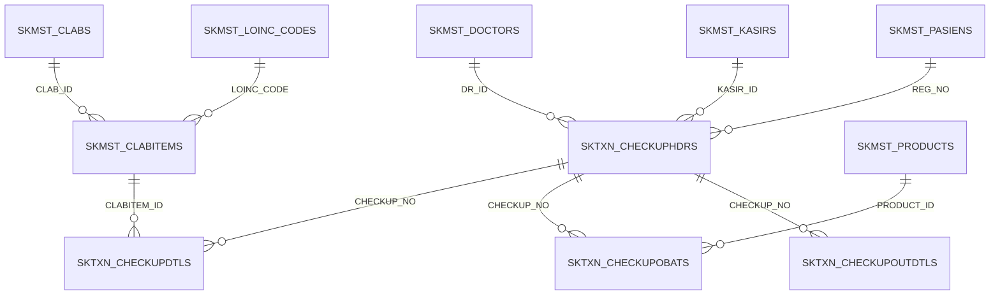

### Pasien & Klinik

_Master pasien, dokter, poli, referensi kunjungan (cara masuk/keluar, klaim), ICD-10/ICD-9, radiologi, jadwal poli_

| Objek | Jenis | Kolom |
|---|---|---|
| `SKMST_DOCTORS` | TABLE | 14 |
| `SKMST_EDUCATIONS` | TABLE | 2 |
| `SKMST_ENTRYTYPES` | TABLE | 2 |
| `SKMST_JOBS` | TABLE | 2 |
| `SKMST_KLAIMTYPES` | TABLE | 3 |
| `SKMST_MEDIK` | TABLE | 10 |
| `SKMST_MSTDIAGS` | TABLE | 3 |
| `SKMST_MSTPROCEDURES` | TABLE | 2 |
| `SKMST_OTHERS` | TABLE | 4 |
| `SKMST_OUTS` | TABLE | 2 |
| `SKMST_PASIENS` | TABLE | 33 |
| `SKMST_POLIS` | TABLE | 4 |
| `SKMST_RADIOLOGIS` | TABLE | 7 |
| `SKMST_RELIGIONS` | TABLE | 2 |
| `SKMST_SCDAYS` | TABLE | 2 |
| `SKMST_SCPOLIS` | TABLE | 11 |
| `SKVIEW_SCPOLIS` | VIEW | 16 |

| Anak.kolom | | Induk.kolom | Constraint |
|---|---|---|---|
| `SKMST_DOCTORS.POLI_ID` | → | `SKMST_POLIS.POLI_ID` | `DOCTORS_POLI_FK` |
| `SKMST_PASIENS.DES_ID` | → | `SKMST_DESAS.DES_ID` | `PASIENS_DES_FK` |
| `SKMST_PASIENS.EDU_ID` | → | `SKMST_EDUCATIONS.EDU_ID` | `PASIENS_EDU_FK` |
| `SKMST_PASIENS.JOB_ID` | → | `SKMST_JOBS.JOB_ID` | `PASIENS_JOB_FK` |
| `SKMST_PASIENS.KAB_ID` | → | `SKMST_KABUPATENS.KAB_ID` | `PASIENS_KAB_FK` |
| `SKMST_PASIENS.KEC_ID` | → | `SKMST_KECAMATANS.KEC_ID` | `PASIENS_KEC_FK` |
| `SKMST_PASIENS.PROP_ID` | → | `SKMST_PROPINSIS.PROP_ID` | `PASIENS_PROP_FK` |
| `SKMST_PASIENS.REL_ID` | → | `SKMST_RELIGIONS.REL_ID` | `PASIENS_REL_FK` |
| `SKMST_RADIOLOGIS.LOINC_CODE` | → | `SKMST_LOINC_CODES.LOINC_CODE` | `RADIOLOGIS_LOINC_CODE_FK` |
| `SKMST_SCPOLIS.DAY_ID` | → | `SKMST_SCDAYS.DAY_ID` | `SCPOLIS_DAY_FK` |
| `SKMST_SCPOLIS.DR_ID` | → | `SKMST_DOCTORS.DR_ID` | `SCPOLIS_DR_FK` |
| `SKMST_SCPOLIS.POLI_ID` | → | `SKMST_POLIS.POLI_ID` | `SCPOLIS_POLI_FK` |

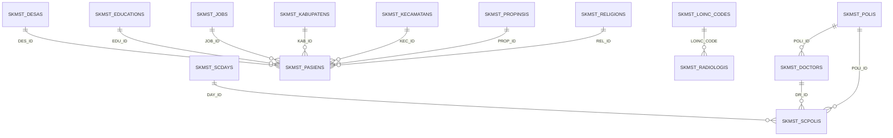

### Tarif & Jasa

_Tarif tindakan dokter (ACCDOC), pegawai (ACTE), paramedis (ACTPAR) beserta komponen obat/lain_

| Objek | Jenis | Kolom |
|---|---|---|
| `SKMST_ACCDOCOTHERS` | TABLE | 3 |
| `SKMST_ACCDOCPRODUCTS` | TABLE | 3 |
| `SKMST_ACCDOCS` | TABLE | 4 |
| `SKMST_ACTEMPS` | TABLE | 4 |
| `SKMST_ACTEOTHERS` | TABLE | 3 |
| `SKMST_ACTEPRODS` | TABLE | 3 |
| `SKMST_ACTPARAMEDICS` | TABLE | 4 |
| `SKMST_ACTPAROTHERS` | TABLE | 3 |
| `SKMST_ACTPARPRODUCTS` | TABLE | 3 |

| Anak.kolom | | Induk.kolom | Constraint |
|---|---|---|---|
| `SKMST_ACCDOCOTHERS.OTHER_ID` | → | `SKMST_OTHERS.OTHER_ID` | `ACCDOCOTHERS_OTHER_FK` |
| `SKMST_ACCDOCPRODUCTS.ACCDOC_ID` | → | `SKMST_ACCDOCS.ACCDOC_ID` | `ACCDOCPRODUCTS_ACCDOC_FK` |
| `SKMST_ACTEOTHERS.ACTE_ID` | → | `SKMST_ACTEMPS.ACTE_ID` | `ACTEOTHERS_ACTE_FK` |
| `SKMST_ACTEOTHERS.OTHER_ID` | → | `SKMST_OTHERS.OTHER_ID` | `ACTEOTHERS_OTHER_FK` |
| `SKMST_ACTEPRODS.ACTE_ID` | → | `SKMST_ACTEMPS.ACTE_ID` | `ACTEPRODS_ACTE_FK` |
| `SKMST_ACTPAROTHERS.OTHER_ID` | → | `SKMST_OTHERS.OTHER_ID` | `ACTPAROTHERS_OTHER_FK` |
| `SKMST_ACTPAROTHERS.PACT_ID` | → | `SKMST_ACTPARAMEDICS.PACT_ID` | `ACTPAROTHERS_PACT_FK` |
| `SKMST_ACTPARPRODUCTS.PACT_ID` | → | `SKMST_ACTPARAMEDICS.PACT_ID` | `ACTPARPRODUCTS_PACT_FK` |
| `SKMST_ACCDOCOTHERS.ACCDOC_ID` | ⇢ | `SKMST_ACCDOCS` | implisit |

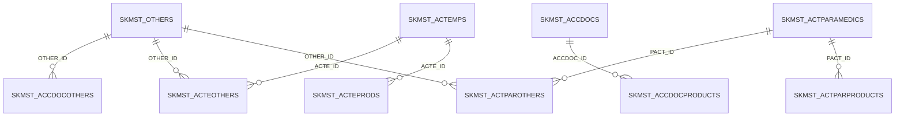

### Wilayah

_Hirarki wilayah untuk alamat pasien (kode BPS = kode wilayah SATUSEHAT)_

| Objek | Jenis | Kolom |
|---|---|---|
| `SKMST_DESAS` | TABLE | 3 |
| `SKMST_KABUPATENS` | TABLE | 3 |
| `SKMST_KECAMATANS` | TABLE | 3 |
| `SKMST_PROPINSIS` | TABLE | 2 |

| Anak.kolom | | Induk.kolom | Constraint |
|---|---|---|---|
| `SKMST_DESAS.KEC_ID` | → | `SKMST_KECAMATANS.KEC_ID` | `DESAS_KEC_FK` |
| `SKMST_KABUPATENS.PROP_ID` | → | `SKMST_PROPINSIS.PROP_ID` | `KABUPATENS_PROP_FK` |
| `SKMST_KECAMATANS.KAB_ID` | → | `SKMST_KABUPATENS.KAB_ID` | `KECAMATANS_KAB_FK` |

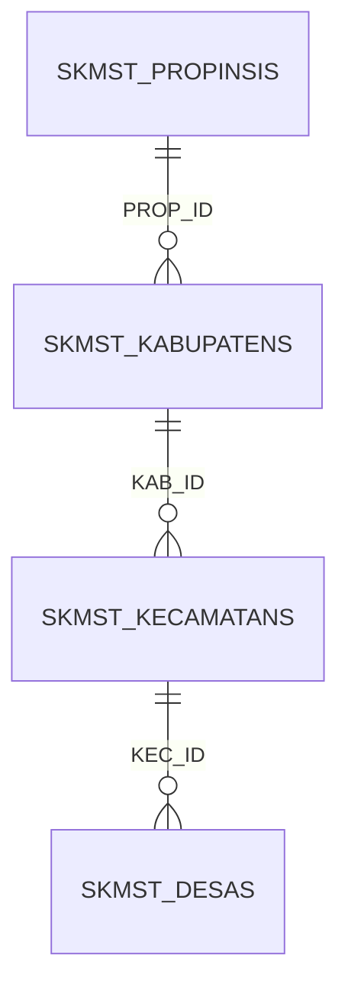

### Terminologi SATUSEHAT

_Kamus LOINC (lab/radiologi) & SNOMED untuk kirim FHIR_

| Objek | Jenis | Kolom |
|---|---|---|
| `SKMST_LOINC_CODES` | TABLE | 6 |
| `SKMST_SNOMED_CODES` | TABLE | 5 |

### Akuntansi

_Bagan akun (SKACC_ACCOUNTSES), cara bayar, konfigurasi jurnal, template laba-rugi/neraca_

| Objek | Jenis | Kolom |
|---|---|---|
| `SKACC_ACCOUNTSES` | TABLE | 6 |
| `SKACC_CARABAYARS` | TABLE | 4 |
| `SKACC_CONFACCTXNS` | TABLE | 3 |
| `SKACC_GR_ACCOUNTSES` | TABLE | 4 |
| `SKACC_TEMACCOUNTES` | TABLE | 3 |
| `SKACC_TEMLABARUGINERACADTLS` | TABLE | 5 |
| `SKACC_TEMLABARUGINERACAHDRS` | TABLE | 3 |
| `SKACC_TUCICOS` | TABLE | 5 |
| `SKVIEW_ACCOUNTS` | VIEW | 6 |
| `SKVIEW_ACCOUNTS_LABARUGI` | VIEW | 6 |
| `SKVIEW_ACCOUNTS_NERACA` | VIEW | 5 |
| `SKVIEW_ACCTEMPLATE` | VIEW | 10 |

| Anak.kolom | | Induk.kolom | Constraint |
|---|---|---|---|
| `SKACC_ACCOUNTSES.GRA_ID` | → | `SKACC_GR_ACCOUNTSES.GRA_ID` | `ACCOUNTSES_GRA_FK` |
| `SKACC_CARABAYARS.ACC_ID` | → | `SKACC_ACCOUNTSES.ACC_ID` | `CARABAYARS_ACC_FK` |
| `SKACC_CONFACCTXNS.ACC_ID` | → | `SKACC_ACCOUNTSES.ACC_ID` | `CONFACCTXNS_ACC_FK` |
| `SKACC_TEMACCOUNTES.ACC_ID` | → | `SKACC_ACCOUNTSES.ACC_ID` | `TEMACCOUNTES_ACC_FK` |
| `SKACC_TEMACCOUNTES.TEMP_DTL` | → | `SKACC_TEMLABARUGINERACADTLS.TEMP_DTL` | `TEMACCOUNTES_TEMP_DTL_FK` |
| `SKACC_TEMLABARUGINERACADTLS.GRA_ID` | → | `SKACC_GR_ACCOUNTSES.GRA_ID` | `TEMLABARUGINERACADTLS_GRA_FK` |
| `SKACC_TEMLABARUGINERACADTLS.TEMP_ID` | → | `SKACC_TEMLABARUGINERACAHDRS.TEMP_ID` | `TEMLABARUGINERACADTLS_TEMP_FK` |
| `SKACC_TUCICOS.ACC_ID` | → | `SKACC_ACCOUNTSES.ACC_ID` | `TUCICOS_ACC_FK` |

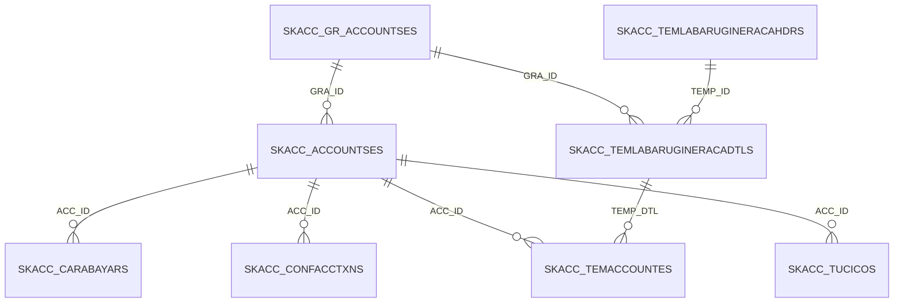

### Kas & Hutang-Piutang

_Penerimaan/pengeluaran kas, kas TU, saldo awal akun/hutang/piutang_

| Objek | Jenis | Kolom |
|---|---|---|
| `SKTXN_CASHINDTLS` | TABLE | 3 |
| `SKTXN_CASHINHDRS` | TABLE | 7 |
| `SKTXN_CASHOUTDTLNONS` | TABLE | 3 |
| `SKTXN_CASHOUTDTLS` | TABLE | 3 |
| `SKTXN_CASHOUTHDRNONS` | TABLE | 7 |
| `SKTXN_CASHOUTHDRS` | TABLE | 7 |
| `SKTXN_SALDOAWALAKUNS` | TABLE | 4 |
| `SKTXN_SALDOAWALHUTANGS` | TABLE | 3 |
| `SKTXN_SALDOAWALPIUTANGS` | TABLE | 3 |
| `SKTXN_TUCASHINS` | TABLE | 8 |
| `SKTXN_TUCASHOUTS` | TABLE | 8 |
| `SKVIEW_IOHUTANGS` | VIEW | 7 |
| `SKVIEW_IOPIUTANGS` | VIEW | 7 |
| `SKVIEW_SALDOAWALHUTANG` | VIEW | 4 |
| `SKVIEW_SALDOAWALPIUTANG` | VIEW | 4 |

| Anak.kolom | | Induk.kolom | Constraint |
|---|---|---|---|
| `SKTXN_CASHINDTLS.CASHIN_NO` | → | `SKTXN_CASHINHDRS.CASHIN_NO` | `CASHINDTLS_CASHIN_NO_FK` |
| `SKTXN_CASHINDTLS.SLS_NO` | → | `SKTXN_SLSHDRS.SLS_NO` | `CASHINDTLS_SLS_NO_FK` |
| `SKTXN_CASHINHDRS.CB_ID` | → | `SKACC_CARABAYARS.CB_ID` | `CASHINHDRS_CB_FK` |
| `SKTXN_CASHINHDRS.CM_ID` | → | `SKMST_CUSTOMERS.CM_ID` | `CASHINHDRS_CM_FK` |
| `SKTXN_CASHINHDRS.KASIR_ID` | → | `SKMST_KASIRS.KASIR_ID` | `CASHINHDRS_KASIR_FK` |
| `SKTXN_CASHOUTDTLNONS.CASHOUT_NO` | → | `SKTXN_CASHOUTHDRNONS.CASHOUT_NO` | `FK_CODTLNONS_HDR` |
| `SKTXN_CASHOUTDTLNONS.RCV_NO` | → | `SKTXN_RCVHDRNONS.RCV_NO` | `FK_CODTLNONS_RCV` |
| `SKTXN_CASHOUTDTLS.CASHOUT_NO` | → | `SKTXN_CASHOUTHDRS.CASHOUT_NO` | `CASHOUTDTLS_CASHOUT_NO_FK` |
| `SKTXN_CASHOUTDTLS.RCV_NO` | → | `SKTXN_RCVHDRS.RCV_NO` | `CASHOUTDTLS_RCV_NO_FK` |
| `SKTXN_CASHOUTHDRNONS.CB_ID` | → | `SKACC_CARABAYARS.CB_ID` | `CASHOUTHDRNONS_CB_FK` |
| `SKTXN_CASHOUTHDRNONS.KASIR_ID` | → | `SKMST_KASIRS.KASIR_ID` | `CASHOUTHDRNONS_KASIR_FK` |
| `SKTXN_CASHOUTHDRNONS.SUPP_ID` | → | `SKMST_SUPPLIERS.SUPP_ID` | `CASHOUTHDRNONS_SUPP_FK` |
| `SKTXN_CASHOUTHDRS.CB_ID` | → | `SKACC_CARABAYARS.CB_ID` | `CASHOUTHDRS_CB_FK` |
| `SKTXN_CASHOUTHDRS.KASIR_ID` | → | `SKMST_KASIRS.KASIR_ID` | `CASHOUTHDRS_KASIR_FK` |
| `SKTXN_CASHOUTHDRS.SUPP_ID` | → | `SKMST_SUPPLIERS.SUPP_ID` | `CASHOUTHDRS_SUPP_FK` |
| `SKTXN_SALDOAWALAKUNS.ACC_ID` | → | `SKACC_ACCOUNTSES.ACC_ID` | `SALDOAWALAKUNS_ACC_FK` |
| `SKTXN_SALDOAWALHUTANGS.SUPP_ID` | → | `SKMST_SUPPLIERS.SUPP_ID` | `SALDOAWALHUTANGS_SUPP_FK` |
| `SKTXN_SALDOAWALPIUTANGS.CM_ID` | → | `SKMST_CUSTOMERS.CM_ID` | `SALDOAWALPIUTANGS_CM_FK` |
| `SKTXN_TUCASHINS.CB_ID` | → | `SKACC_CARABAYARS.CB_ID` | `TUCASHINS_CB_FK` |
| `SKTXN_TUCASHINS.KASIR_ID` | → | `SKMST_KASIRS.KASIR_ID` | `TUCASHINS_KASIR_FK` |
| `SKTXN_TUCASHINS.TUCICO_ID` | → | `SKACC_TUCICOS.TUCICO_ID` | `TUCASHINS_TUCICO_FK` |
| `SKTXN_TUCASHOUTS.CB_ID` | → | `SKACC_CARABAYARS.CB_ID` | `TUCASHOUTS_CB_FK` |
| `SKTXN_TUCASHOUTS.KASIR_ID` | → | `SKMST_KASIRS.KASIR_ID` | `TUCASHOUTS_KASIR_FK` |
| `SKTXN_TUCASHOUTS.TUCICO_ID` | → | `SKACC_TUCICOS.TUCICO_ID` | `TUCASHOUTS_TUCICO_FK` |

```mermaid
erDiagram
    SKTXN_CASHINHDRS ||--o{ SKTXN_CASHINDTLS : "CASHIN_NO"
    SKTXN_SLSHDRS ||--o{ SKTXN_CASHINDTLS : "SLS_NO"
    SKACC_CARABAYARS ||--o{ SKTXN_CASHINHDRS : "CB_ID"
    SKMST_CUSTOMERS ||--o{ SKTXN_CASHINHDRS : "CM_ID"
    SKMST_KASIRS ||--o{ SKTXN_CASHINHDRS : "KASIR_ID"
    SKTXN_CASHOUTHDRNONS ||--o{ SKTXN_CASHOUTDTLNONS : "CASHOUT_NO"
    SKTXN_RCVHDRNONS ||--o{ SKTXN_CASHOUTDTLNONS : "RCV_NO"
    SKTXN_CASHOUTHDRS ||--o{ SKTXN_CASHOUTDTLS : "CASHOUT_NO"
    SKTXN_RCVHDRS ||--o{ SKTXN_CASHOUTDTLS : "RCV_NO"
    SKACC_CARABAYARS ||--o{ SKTXN_CASHOUTHDRNONS : "CB_ID"
    SKMST_KASIRS ||--o{ SKTXN_CASHOUTHDRNONS : "KASIR_ID"
    SKMST_SUPPLIERS ||--o{ SKTXN_CASHOUTHDRNONS : "SUPP_ID"
    SKACC_CARABAYARS ||--o{ SKTXN_CASHOUTHDRS : "CB_ID"
    SKMST_KASIRS ||--o{ SKTXN_CASHOUTHDRS : "KASIR_ID"
    SKMST_SUPPLIERS ||--o{ SKTXN_CASHOUTHDRS : "SUPP_ID"
    SKACC_ACCOUNTSES ||--o{ SKTXN_SALDOAWALAKUNS : "ACC_ID"
    SKMST_SUPPLIERS ||--o{ SKTXN_SALDOAWALHUTANGS : "SUPP_ID"
    SKMST_CUSTOMERS ||--o{ SKTXN_SALDOAWALPIUTANGS : "CM_ID"
    SKACC_CARABAYARS ||--o{ SKTXN_TUCASHINS : "CB_ID"
    SKMST_KASIRS ||--o{ SKTXN_TUCASHINS : "KASIR_ID"
    SKACC_TUCICOS ||--o{ SKTXN_TUCASHINS : "TUCICO_ID"
    SKACC_CARABAYARS ||--o{ SKTXN_TUCASHOUTS : "CB_ID"
    SKMST_KASIRS ||--o{ SKTXN_TUCASHOUTS : "KASIR_ID"
    SKACC_TUCICOS ||--o{ SKTXN_TUCASHOUTS : "TUCICO_ID"
```

### Apotek & Gudang (master)

_Master obat/barang (SKMST_PRODUCTS = master obat klinik), satuan, kategori, supplier, kasir, signa_

| Objek | Jenis | Kolom |
|---|---|---|
| `SKMST_CATEGORIES` | TABLE | 3 |
| `SKMST_CONTENTS` | TABLE | 2 |
| `SKMST_CUSTOMERS` | TABLE | 9 |
| `SKMST_EX_IMS` | TABLE | 2 |
| `SKMST_KASIRS` | TABLE | 3 |
| `SKMST_KOTAS` | TABLE | 3 |
| `SKMST_PRODUCTCONTENTS` | TABLE | 5 |
| `SKMST_PRODUCTNONS` | TABLE | 7 |
| `SKMST_PRODUCTPAKETS` | TABLE | 4 |
| `SKMST_PRODUCTS` | TABLE | 14 |
| `SKMST_PROVS` | TABLE | 2 |
| `SKMST_SIGNA_CATATANS` | TABLE | 2 |
| `SKMST_SUPPLIERS` | TABLE | 7 |
| `SKMST_UOMS` | TABLE | 3 |

| Anak.kolom | | Induk.kolom | Constraint |
|---|---|---|---|
| `SKMST_CUSTOMERS.KOTA_ID, PROV_ID` | → | `SKMST_KOTAS.KOTA_ID, PROV_ID` | `CUSTOMERS_KOTA_PROV_FK` |
| `SKMST_CUSTOMERS.PROV_ID` | → | `SKMST_PROVS.PROV_ID` | `CUSTOMERS_PROV_FK` |
| `SKMST_KOTAS.PROV_ID` | → | `SKMST_PROVS.PROV_ID` | `KOTAS_PROV_FK` |
| `SKMST_PRODUCTCONTENTS.CONT_ID` | → | `SKMST_CONTENTS.CONT_ID` | `PRODUCTCONTENTS_CONT_FK` |
| `SKMST_PRODUCTCONTENTS.UOM_ID` | → | `SKMST_UOMS.UOM_ID` | `PRODUCTCONTENTS_UOM_FK` |
| `SKMST_PRODUCTNONS.UOM_ID` | → | `SKMST_UOMS.UOM_ID` | `PRODUCTNONS_UOM_FK` |
| `SKMST_PRODUCTPAKETS.PRODUCT_ID` | → | `SKMST_PRODUCTS.PRODUCT_ID` | `PRODUCTPAKETS_PRODUCT_FK` |
| `SKMST_PRODUCTPAKETS.PRODUCT_ID_PROD` | → | `SKMST_PRODUCTS.PRODUCT_ID` | `PRODUCTPAKE_PRODUCT_ID_PROD_FK` |
| `SKMST_PRODUCTS.CAT_ID` | → | `SKMST_CATEGORIES.CAT_ID` | `PRODUCTS_CAT_FK` |
| `SKMST_PRODUCTS.SUPP_ID` | → | `SKMST_SUPPLIERS.SUPP_ID` | `PRODUCTS_SUPP_FK` |
| `SKMST_PRODUCTS.UOM_ID` | → | `SKMST_UOMS.UOM_ID` | `PRODUCTS_UOM_FK` |

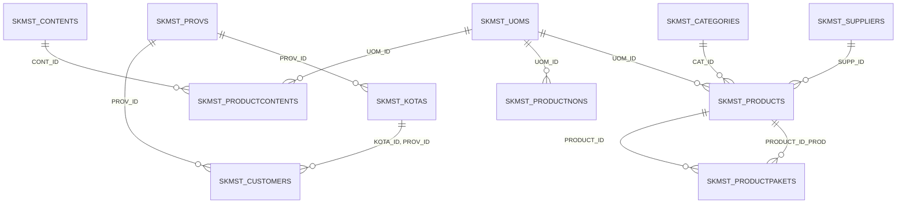

### Apotek & Gudang (transaksi)

_Penjualan bebas, penerimaan dari PBF/supplier, stock opname, kartu stok, HPP_

| Objek | Jenis | Kolom |
|---|---|---|
| `SKTXN_RCVDTLNONS` | TABLE | 9 |
| `SKTXN_RCVDTLS` | TABLE | 9 |
| `SKTXN_RCVHDRNONS` | TABLE | 14 |
| `SKTXN_RCVHDRS` | TABLE | 16 |
| `SKTXN_RCVPAYMENTNONS` | TABLE | 4 |
| `SKTXN_RCVPAYMENTS` | TABLE | 4 |
| `SKTXN_SALDOAWALSTOCKS` | TABLE | 4 |
| `SKTXN_SALDOAWALSTOCKSNON` | TABLE | 3 |
| `SKTXN_SLSDTLS` | TABLE | 7 |
| `SKTXN_SLSHDRS` | TABLE | 13 |
| `SKTXN_SLSKIRIMS` | TABLE | 8 |
| `SKTXN_SLSPAYMENTS` | TABLE | 4 |
| `SKTXN_SOWHS` | TABLE | 7 |
| `SKTXN_SOWHSNON` | TABLE | 7 |
| `SKVIEW_HPPES` | VIEW | 6 |
| `SKVIEW_IOSTOCKWHS` | VIEW | 7 |
| `SKVIEW_IOSTOCKWHSNON` | VIEW | 6 |
| `SKVIEW_LASTRCV` | VIEW | 3 |
| `SKVIEW_RCVDTLS` | VIEW | 8 |
| `SKVIEW_RCVHDRS` | VIEW | 11 |
| `SKVIEW_RCVPAYS` | VIEW | 5 |
| `SKVIEW_SALDOAKHIRSTOCKS` | VIEW | 4 |
| `SKVIEW_SALDOAWALSTOCKS` | VIEW | 7 |
| `SKVIEW_SALDOSTOCK_LIST` | VIEW | 8 |
| `SKVIEW_SLSHDRS` | VIEW | 9 |
| `SKVIEW_SLSPAYS` | VIEW | 5 |

| Anak.kolom | | Induk.kolom | Constraint |
|---|---|---|---|
| `SKTXN_RCVDTLNONS.RCV_NO` | → | `SKTXN_RCVHDRNONS.RCV_NO` | `FK_RCVDTLNONS_HDR` |
| `SKTXN_RCVDTLNONS.PRODUCT_ID` | → | `SKMST_PRODUCTNONS.PRODUCT_ID` | `FK_RCVDTLNONS_PRD` |
| `SKTXN_RCVDTLS.PRODUCT_ID` | → | `SKMST_PRODUCTS.PRODUCT_ID` | `RCVDTLS_PRODUCT_FK` |
| `SKTXN_RCVDTLS.RCV_NO` | → | `SKTXN_RCVHDRS.RCV_NO` | `RCVDTLS_RCV_NO_FK` |
| `SKTXN_RCVHDRNONS.CB_ID` | → | `SKACC_CARABAYARS.CB_ID` | `RCVHDRNONS_CB_FK` |
| `SKTXN_RCVHDRNONS.KASIR_ID` | → | `SKMST_KASIRS.KASIR_ID` | `RCVHDRNONS_KASIR_FK` |
| `SKTXN_RCVHDRNONS.SUPP_ID` | → | `SKMST_SUPPLIERS.SUPP_ID` | `RCVHDRNONS_SUPP_FK` |
| `SKTXN_RCVHDRS.CB_ID` | → | `SKACC_CARABAYARS.CB_ID` | `RCVHDRS_CB_FK` |
| `SKTXN_RCVHDRS.KASIR_ID` | → | `SKMST_KASIRS.KASIR_ID` | `RCVHDRS_KASIR_FK` |
| `SKTXN_RCVHDRS.SUPP_ID` | → | `SKMST_SUPPLIERS.SUPP_ID` | `RCVHDRS_SUPP_FK` |
| `SKTXN_RCVPAYMENTNONS.RCV_NO` | → | `SKTXN_RCVHDRNONS.RCV_NO` | `FK_RCVPAYNONS_HDR` |
| `SKTXN_RCVPAYMENTS.RCV_NO` | → | `SKTXN_RCVHDRS.RCV_NO` | `RCVPAYMENTS_RCV_NO_FK` |
| `SKTXN_SALDOAWALSTOCKS.PRODUCT_ID` | → | `SKMST_PRODUCTS.PRODUCT_ID` | `SALDOAWALSTOCKS_PRODUCT_FK` |
| `SKTXN_SALDOAWALSTOCKSNON.PRODUCT_ID` | → | `SKMST_PRODUCTNONS.PRODUCT_ID` | `FK_SALDONON_PRD` |
| `SKTXN_SLSDTLS.PRODUCT_ID` | → | `SKMST_PRODUCTS.PRODUCT_ID` | `SLSDTLS_PRODUCT_FK` |
| `SKTXN_SLSDTLS.SLS_NO` | → | `SKTXN_SLSHDRS.SLS_NO` | `SLSDTLS_SLS_NO_FK` |
| `SKTXN_SLSHDRS.CB_ID` | → | `SKACC_CARABAYARS.CB_ID` | `SLSHDRS_CB_FK` |
| `SKTXN_SLSHDRS.CM_ID` | → | `SKMST_CUSTOMERS.CM_ID` | `SLSHDRS_CM_FK` |
| `SKTXN_SLSHDRS.KASIR_ID` | → | `SKMST_KASIRS.KASIR_ID` | `SLSHDRS_KASIR_FK` |
| `SKTXN_SLSKIRIMS.KOTA_ID, PROV_ID` | → | `SKMST_KOTAS.KOTA_ID, PROV_ID` | `SLSKIRIMS_KOTA_PROV_FK` |
| `SKTXN_SLSKIRIMS.PROV_ID` | → | `SKMST_PROVS.PROV_ID` | `SLSKIRIMS_PROV_FK` |
| `SKTXN_SLSKIRIMS.SLS_NO` | → | `SKTXN_SLSHDRS.SLS_NO` | `SLSKIRIMS_SLS_NO_FK` |
| `SKTXN_SLSPAYMENTS.SLS_NO` | → | `SKTXN_SLSHDRS.SLS_NO` | `SLSPAYMENTS_SLS_NO_FK` |
| `SKTXN_SOWHS.KASIR_ID` | → | `SKMST_KASIRS.KASIR_ID` | `SOWHS_KASIR_FK` |
| `SKTXN_SOWHS.PRODUCT_ID` | → | `SKMST_PRODUCTS.PRODUCT_ID` | `SOWHS_PRODUCT_FK` |
| `SKTXN_SOWHSNON.PRODUCT_ID` | → | `SKMST_PRODUCTNONS.PRODUCT_ID` | `FK_SOWHSNON_PRD` |
| `SKTXN_SOWHSNON.KASIR_ID` | → | `SKMST_KASIRS.KASIR_ID` | `SOWHSNON_KASIR_FK` |

```mermaid
erDiagram
    SKTXN_RCVHDRNONS ||--o{ SKTXN_RCVDTLNONS : "RCV_NO"
    SKMST_PRODUCTNONS ||--o{ SKTXN_RCVDTLNONS : "PRODUCT_ID"
    SKMST_PRODUCTS ||--o{ SKTXN_RCVDTLS : "PRODUCT_ID"
    SKTXN_RCVHDRS ||--o{ SKTXN_RCVDTLS : "RCV_NO"
    SKACC_CARABAYARS ||--o{ SKTXN_RCVHDRNONS : "CB_ID"
    SKMST_KASIRS ||--o{ SKTXN_RCVHDRNONS : "KASIR_ID"
    SKMST_SUPPLIERS ||--o{ SKTXN_RCVHDRNONS : "SUPP_ID"
    SKACC_CARABAYARS ||--o{ SKTXN_RCVHDRS : "CB_ID"
    SKMST_KASIRS ||--o{ SKTXN_RCVHDRS : "KASIR_ID"
    SKMST_SUPPLIERS ||--o{ SKTXN_RCVHDRS : "SUPP_ID"
    SKTXN_RCVHDRNONS ||--o{ SKTXN_RCVPAYMENTNONS : "RCV_NO"
    SKTXN_RCVHDRS ||--o{ SKTXN_RCVPAYMENTS : "RCV_NO"
    SKMST_PRODUCTS ||--o{ SKTXN_SALDOAWALSTOCKS : "PRODUCT_ID"
    SKMST_PRODUCTNONS ||--o{ SKTXN_SALDOAWALSTOCKSNON : "PRODUCT_ID"
    SKMST_PRODUCTS ||--o{ SKTXN_SLSDTLS : "PRODUCT_ID"
    SKTXN_SLSHDRS ||--o{ SKTXN_SLSDTLS : "SLS_NO"
    SKACC_CARABAYARS ||--o{ SKTXN_SLSHDRS : "CB_ID"
    SKMST_CUSTOMERS ||--o{ SKTXN_SLSHDRS : "CM_ID"
    SKMST_KASIRS ||--o{ SKTXN_SLSHDRS : "KASIR_ID"
    SKMST_KOTAS ||--o{ SKTXN_SLSKIRIMS : "KOTA_ID, PROV_ID"
    SKMST_PROVS ||--o{ SKTXN_SLSKIRIMS : "PROV_ID"
    SKTXN_SLSHDRS ||--o{ SKTXN_SLSKIRIMS : "SLS_NO"
    SKTXN_SLSHDRS ||--o{ SKTXN_SLSPAYMENTS : "SLS_NO"
    SKMST_KASIRS ||--o{ SKTXN_SOWHS : "KASIR_ID"
    SKMST_PRODUCTS ||--o{ SKTXN_SOWHS : "PRODUCT_ID"
    SKMST_PRODUCTNONS ||--o{ SKTXN_SOWHSNON : "PRODUCT_ID"
    SKMST_KASIRS ||--o{ SKTXN_SOWHSNON : "KASIR_ID"
```

### Aplikasi & Identitas

_Identitas klinik (kop), parameter sistem, menu/user aplikasi warisan_

| Objek | Jenis | Kolom |
|---|---|---|
| `SKMST_APPLICATIONS` | TABLE | 7 |
| `SKMST_IDENTITASES` | TABLE | 26 |
| `SKMST_PARAMETERS` | TABLE | 3 |
| `SKMST_USERAPPLICATIONS` | TABLE | 2 |
| `SKMST_USERS` | TABLE | 5 |
| `SKVIEW_APPLICATIONS` | VIEW | 6 |

| Anak.kolom | | Induk.kolom | Constraint |
|---|---|---|---|
| `SKMST_USERAPPLICATIONS.APP_CODE` | → | `SKMST_APPLICATIONS.APP_CODE` | `USERAPPLICATIONS_APP_CODE_FK` |
| `SKMST_USERAPPLICATIONS.USER_CODE` | → | `SKMST_USERS.USER_CODE` | `USERAPPLICATIONS_USER_CODE_FK` |

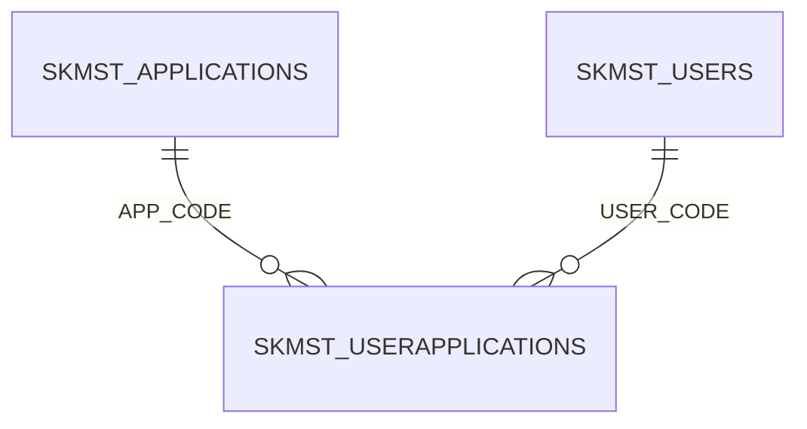

### BPJS & Log

_Cache referensi PCare, antrean Mobile JKN, log pemanggilan API eksternal_

| Objek | Jenis | Kolom |
|---|---|---|
| `PASIEN` | TABLE | 11 |
| `REFERENSI_MOBILEJKN_BPJS` | TABLE | 26 |
| `REF_BPJS_TABLE` | TABLE | 2 |
| `WEB_LOG_STATUS` | TABLE | 6 |

### Sistem Laravel

_Tabel bawaan Laravel & Spatie Permission (login, role, sesi, antrean job)_

| Objek | Jenis | Kolom |
|---|---|---|
| `CACHE` | TABLE | 3 |
| `CACHE_LOCKS` | TABLE | 3 |
| `FAILED_JOBS` | TABLE | 7 |
| `JOBS` | TABLE | 7 |
| `JOB_BATCHES` | TABLE | 10 |
| `MIGRATIONS` | TABLE | 3 |
| `MODEL_HAS_PERMISSIONS` | TABLE | 3 |
| `MODEL_HAS_ROLES` | TABLE | 3 |
| `PASSWORD_RESET_TOKENS` | TABLE | 3 |
| `PERMISSIONS` | TABLE | 5 |
| `PERSONAL_ACCESS_TOKENS` | TABLE | 10 |
| `ROLES` | TABLE | 5 |
| `ROLE_HAS_PERMISSIONS` | TABLE | 2 |
| `SESSIONS` | TABLE | 6 |
| `USERS` | TABLE | 15 |

| Anak.kolom | | Induk.kolom | Constraint |
|---|---|---|---|
| `MODEL_HAS_PERMISSIONS.PERMISSION_ID` | → | `PERMISSIONS.ID` | `MODEL_HAS_PERMX2` |
| `MODEL_HAS_ROLES.ROLE_ID` | → | `ROLES.ID` | `MODEL_HAS_ROLES_ROLE_ID_FK` |
| `ROLE_HAS_PERMISSIONS.PERMISSION_ID` | → | `PERMISSIONS.ID` | `MODEL_HAS_PERMX1S` |
| `ROLE_HAS_PERMISSIONS.ROLE_ID` | → | `ROLES.ID` | `MODEL_HAS_PERMX1SS` |

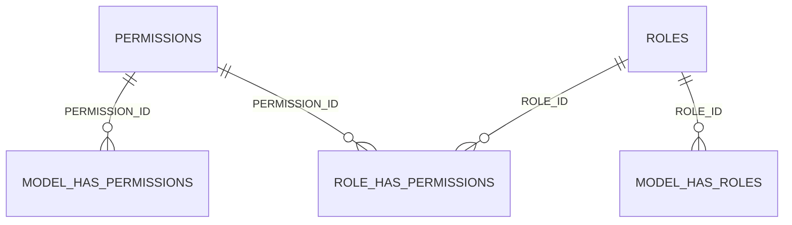

### Lain-lain

_Tabel yang belum dipetakan ke modul mana pun_

| Objek | Jenis | Kolom |
|---|---|---|
| `INSTALL_TOKOKU` | TABLE | 2 |

| Anak.kolom | | Induk.kolom | Constraint |
|---|---|---|---|
| `INSTALL_TOKOKU.ID_EX` | ⇢ | `SKMST_EX_IMS` | implisit |

## 4. Konvensi tabel baru

- Prefix `SKMST_/SKTXN_/SKACC_/SKVIEW_`, nama jamak Inggris huruf besar, ≤ 30 karakter; daftarkan polanya di `App\Support\Skema\ModulTabel`.
- Constraint: `AKAR_PK`, `AKAR_KOLOM_FK`, `AKAR_KOLOM_UK`; index `AKAR_KOLOM_IX` (`AKAR` = nama tabel tanpa prefix, `_ID` kolom dibuang).
- Perubahan schema = SQL idempoten di `database/sql/`, bukan migration Laravel. Sequence `NAMA_SEQ` via `.nextval`.
- Dokumen per kunjungan yang bentuknya berubah → satu kolom CLOB JSON; Oracle 10g tanpa `JSON_VALUE`/`LISTAGG`.
